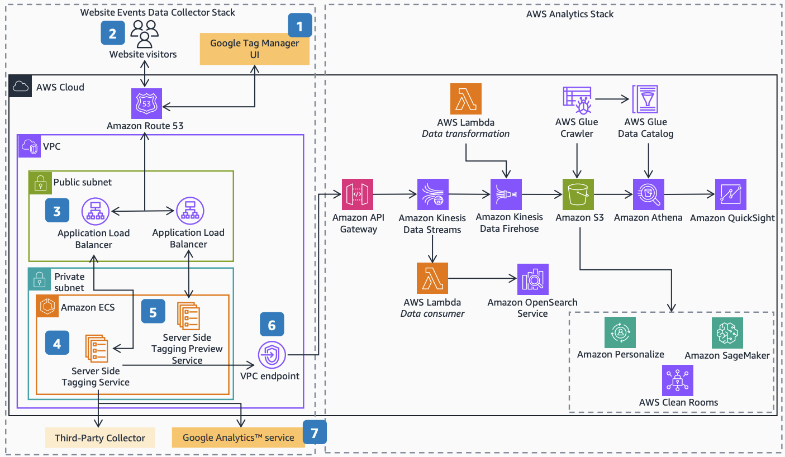
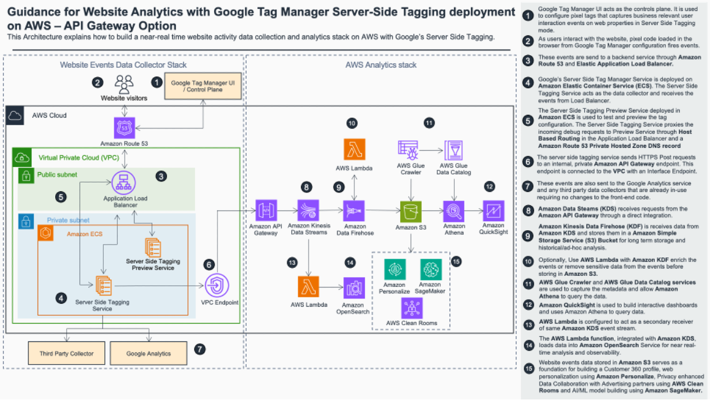
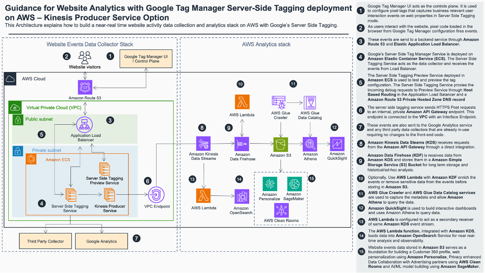
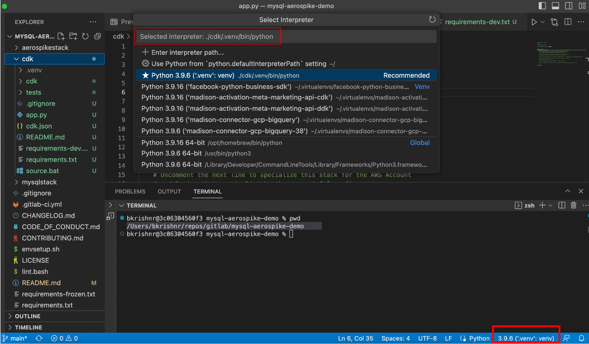
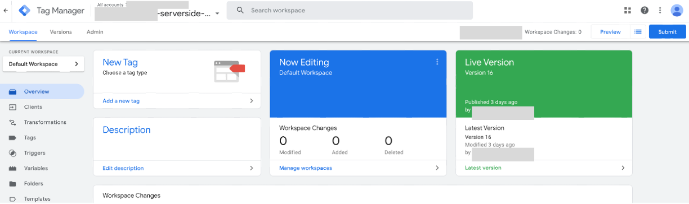
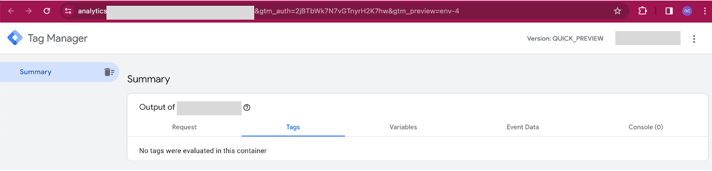
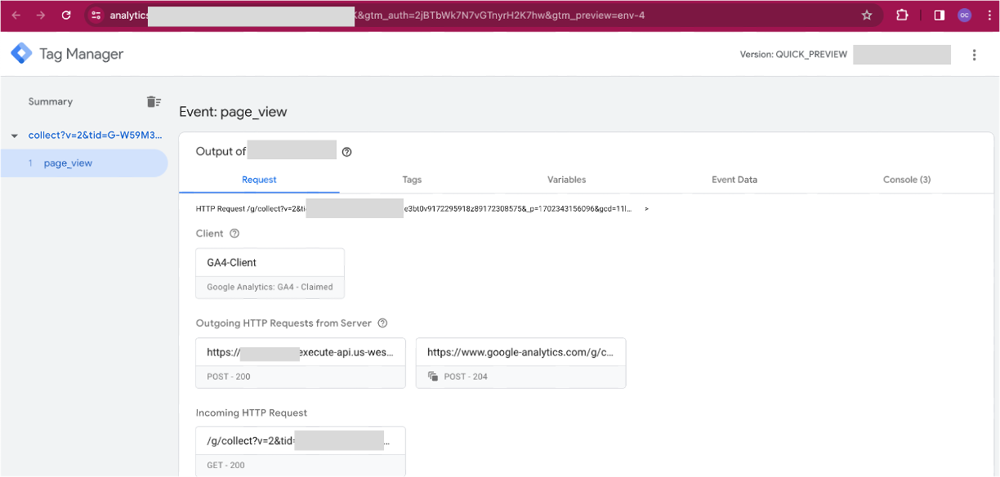
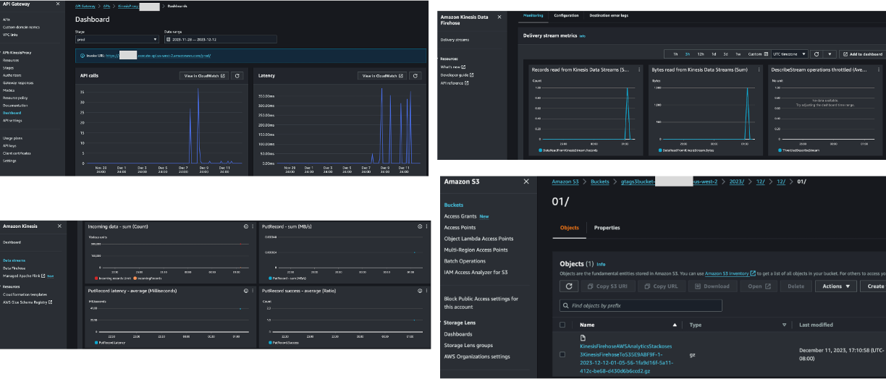

# Guidance for website analytics with google tag manager server side tagging deployment on AWS

## Table of Content

1. [Overview](#overview)
    - [Cost](#cost)
2. [Prerequisites](#prerequisites)
    - [Operating System](#operating-system)
3. [Deployment Steps](#deployment-steps)
4. [Deployment Validation](#deployment-validation)
5. [Running the Guidance](#running-the-guidance)
6. [Next Steps](#next-steps)
7. [Cleanup](#cleanup)
8. [FAQ, known issues, additional considerations, and limitations](#faq-known-issues-additional-considerations-and-limitations)
9. [Revisions](#revisions)
10. [Notices](#notices)
11. [Authors](#authors)

## Overview

Summary: This cdk code deploys the Google Server-Side Tag Manager in a container on AWS using Amazon Elastic Container Service (Amazon ECS). This allows you to collect data directly from web browsers using client-side libraries. Using this implementation, you can gain control over how your website tracking data is collected and processed and where it is sent. You can continue to use the Google Tag Manager control plane and Google Analytics™ service with this Guidance.

The solution illustrates two different configurations each to collect and analyze hit-level data using AWS services:
1) For the data collection you can choose to deploy the stack with a public or private preview server. For the public preview server the stack deploys two application load balancers. For the private preview server the stack deploys a single application load balancer. This choice is controlled using cdk.context.json parameters

2) For data analytics using AWS services you can choose to send data to Amazon Kinesis either through API Gateway or through a Producer Service deployed on the same ECS cluster which runs the Server Side Tagging container. Once events are logged in a Kinesis data stream
    1. You can do historical data analysis and visualization using a data lake architecture with Amazon Kinesis Data Streams, Amazon Kinesis Data Firehose, Amazon Simple Storage Service (Amazon S3), Amazon Athena, and Amazon QuickSight.
    2. Near real-time analysis and visualization using Kinesis Data Streams, Managed Apache Flink, AWS Lambda, and Amazon OpenSearch Service.

### Architecture Overview
#### Public Preview Server Configuration(Multiple ALBs)

#### Private Preview Server Configuration(Single ALB)

#### Kinesis Producer in analytics stack 


### Cost

_You are responsible for the cost of the AWS services used while running this Guidance. As of <month> <year>, the cost for running this Guidance with the default settings in the <Default AWS Region (Most likely will be US East (N. Virginia)) > is approximately $1,180.70 per month for processing ( 1 mil records each day )._

## Prerequisites

### Operating System

The project code uses the Python version of the AWS CDK ([Cloud Development Kit](https://aws.amazon.com/cdk/)). To execute the project code, please ensure that you have fulfilled the [AWS CDK Prerequisites for Python](https://docs.aws.amazon.com/cdk/latest/guide/work-with-cdk-python.html). Steps for a macOS machine is captured here.  Deployment in another OS may require additional steps.

1. Install homebrew
```
/bin/bash -c "$(curl -fsSL https://raw.githubusercontent.com/Homebrew/install/HEAD/install.sh)"
```
2. Install Python
```
brew install python
```
3. Install Git client
```
brew install git
```
4. Install AWS CLI
```
brew install awscli
```
5. Create CLI credentials using IAM in AWS console and Configure CLI profiles
```
aws configure --profile <profile name>
```

### Third-party tools

#### Google Tag Manager Setup

1) Complete the steps mentioned in the [Google Tag Manager Setup section](https://aws-solutions-library-samples.github.io/advertising-marketing/using-google-tag-manager-for-server-side-website-analytics-on-aws.html#google-tag-manager-setup) of the implementation guide.
2) Take a note of the [container config string](https://aws-solutions-library-samples.github.io/advertising-marketing/using-google-tag-manager-for-server-side-website-analytics-on-aws.html#google-tag-manager-setup:~:text=and%20copy%20the-,Container%20Config%20string,-to%20a%20notepad)

### Python Dependencies
Review [requirements.txt](./requirements.txt) for the python dependencies

### AWS account requirements

1) This deployment requires you have public AWS Certificate Manager(ACM) certificate available in your AWS account. See this [implementation guide](https://aws-solutions-library-samples.github.io/advertising-marketing/using-google-tag-manager-for-server-side-website-analytics-on-aws.html#prerequisites) for steps you need to follow.
2) The certificate needs to be in "Issued" status. This happens after the validation of ownership either through DNS validation or Email validation.

### AWS CDK bootstrap

The project code requires that the AWS account is [bootstrapped](https://docs.aws.amazon.com/de_de/cdk/latest/guide/bootstrapping.html) in order to allow the deployment of the CDK stack. Bootstrap CDK on the CLI profile you created earlier
```
cdk bootstrap --profile <profile name>
```

### Service limits


### Supported Regions


## Deployment Steps

1. Clone this repository to your development desktop
```
git clone git@github.com:aws-solutions-library-samples/guidance-for-website-analytics-with-google-tag-manager-server-side-tagging-deployment-on-aws.git
```
2. Use [envsetup.sh](./envsetup.sh) to setup virtual environment and install python dependencies

3. If you are using Visual Studio Code, you may need to update the python interpreter for the project



4. Create a [cdk.context.json](cdk.context.json) file. A example [cdk.context.json.example](cdk.context.json.example)is available in the repo 
    1. Update the SSL certificate arn you got from completing the [Account requirements](#aws-account-requirements) section. Make sure that you have created the SSL certificate in the same AWS Region as you are doing the CDK deployment
    2. Update the location of the Google Tag Manager container image if needed. See [Google Documentation](https://developers.google.com/tag-platform/tag-manager/server-side/manual-setup-guide) for more details on this docker container image.
    3. Update the container config string you created in the [Google Tag Manager setup step](#google-tag-manager-setup)
```
{
    "ssl_cert_arn": "ARN from AWS Certificate manager",
    "gtm_cloud_image": "gcr.io/cloud-tagging-10302018/gtm-cloud-image",
    "container_config": "Container config string copied from Google Tag Manager",
    "preview_server_dns": "DNS name of the preview service end point",
    "primary_server_dns": "DNS name of the primary service end point",
    "root_dns": "Root DNS of the website domain",
    "producer_service_dns": "DNS for the kinesis producer api",
    "data_capture_api_method": "api_gateway"
}
ssl_cert_arn - Create the SSL certificate manually, validate it and give the ARN as input here
gtm_cloud_image - Change this ONLY if google releases a new version of the container image
producer_service_dns - Needed only for kinesis producer is used
data_capture_api_method - api_gateway deploys an api gateway, any other value deploys kinesis producer 
 ```

5. Review the infrastructure components being deployed
```
# data collection stack
cdk synth ServerSideTaggerStack --profile=<profile name>
# analytics stack
cdk synth AWSAnalyticsStack --profile=<profile name>
# for all stacks
cdk synth --profile=<profile name>
```
6. Deploy the workflow sample code and related AWS services used in the Entity resolution workflow
```
# data collection stack
cdk deploy ServerSideTaggerStack --profile=<profile name>
# analytics stack
cdk deploy AWSAnalyticsStack --profile=<profile name>
# for all stacks
cdk deploy --all --profile=<profile name>
```

## Deployment Validation

* Open CloudFormation console and verify the status of the template with the name starting with ServerSideTagger.
* If deployment is successful, you should see an ECS cluster in the console.

## Running the Guidance

### Guidance inputs

1. Complete the [Google Tag Manager Post Deployment Configuration step](https://aws-solutions-library-samples.github.io/advertising-marketing/using-google-tag-manager-for-server-side-website-analytics-on-aws.html#google-tag-manager-post-deployment-configuration) in the implementation guide.
2. Open the Serverside container setup in Google Chrome and click on the preview button on the top right.

3. A new tab will open up that shows you debug information

4. Open your website in another tab and interact with the webpage. Come back to the debug window to view the events fired by tagging configuration. For every interaction event, you should see two outbound events one to Google Analytics and another to the AWS Api gateway end point.


### Expected output
You should be able to see data flowing through API Gateway, Kinesis Data Streams, Firehose and finally in S3.

### Output description
The payload with in S3 bucket should look similar to one in [GA-sample.json](./assets/GA-sample.json)
## Next Steps

The analytics stack is used for demonstration purposes. Modify that to meet your analytical requirements.

## Cleanup

When you’re finished experimenting with this solution, clean up your resources by running the command:

```
# data collection stack
cdk destroy ServerSideTaggerStack --profile=<profile name>
# analytics stack
cdk destroy AWSAnalyticsStack --profile=<profile name>
# for all stacks
cdk destroy --all --profile=<profile name>
```

These commands deletes resources deploying through the solution. S3 buckets containing CloudWatch log groups are retained after the stack is deleted.


## FAQ, known issues, additional considerations, and limitations
1. The Api gateway deployed doesnt have an auth mechanism. If this is of concern, go with kinesis producer approach
2. Consider Kinesis producer source code as fit for dev/test environment. Harden and instrument the code for production worthiness
3. For application logs use AWS Cloud Watch logs. The stack provisions log groups to organize them
4. Implementation guide associated with the guidance captures the steps for creating the public preview server configuration manually in the console

**Known issues**


**Additional considerations**

- The server side tagging infrastructure can be load tested using [AWS Distributed Load Testing Solution](https://aws.amazon.com/solutions/implementations/distributed-load-testing-on-aws/)

- This Guidance does not create create a WAF for APi Gateway. Modify the stack and apply your perimeter security best practices in production

- For high volume environment, use kinesis producer to send data to kinesis is recommended in favor of using API Gateway. See this [AWS Sample](https://github.com/aws-samples/amazon-kinesis-data-processor-aws-fargate) for setting up an ECS producer container that could run on the same cluster as the Tagging Containers.

- Review [AWS Click Stream Analytics Solution](https://aws.amazon.com/solutions/implementations/clickstream-analytics-on-aws/) for building a BI layer on top of click stream data on AWS. Use the [transformer code](https://github.com/awslabs/clickstream-analytics-on-aws/tree/main/examples/custom-plugins/custom-sdk-transformer) to transform the raw data to work with Solution's out of the box BI dashboards. 

- For any feedback, questions, or suggestions, please use the issues tab under this repo.

## Revisions
* Dec 2023 - Initial version
* June 2024 - multiple configurations for data collection and analytics event capture

## Notices

*Customers are responsible for making their own independent assessment of the information in this Guidance. This Guidance: (a) is for informational purposes only, (b) represents AWS current product offerings and practices, which are subject to change without notice, and (c) does not create any commitments or assurances from AWS and its affiliates, suppliers or licensors. AWS products or services are provided “as is” without warranties, representations, or conditions of any kind, whether express or implied. AWS responsibilities and liabilities to its customers are controlled by AWS agreements, and this Guidance is not part of, nor does it modify, any agreement between AWS and its customers.*

## Authors

Prashant Yadav

Micah Walter

Ranjith Krishnamoorthy
