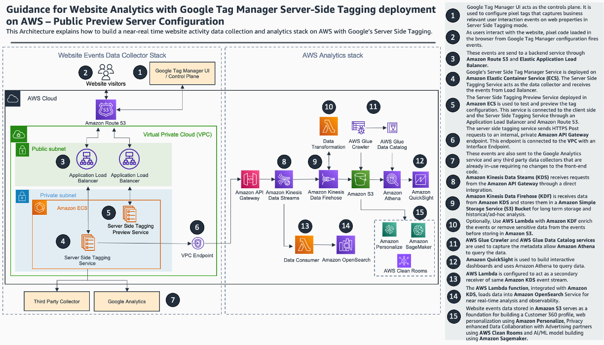

# Guidance for website analytics with google tag manager server side tagging deployment on AWS

## Table of Content

1. [Overview](#overview)
    - [Cost](#cost)
2. [Prerequisites](#prerequisites)
    - [Operating System](#operating-system)
3. [Deployment Steps](#deployment-steps)
4. [Deployment Validation](#deployment-validation)
5. [Running the Guidance](#running-the-guidance)
6. [Next Steps](#next-steps)
7. [Cleanup](#cleanup)
8. [FAQ, known issues, additional considerations, and limitations](#faq-known-issues-additional-considerations-and-limitations)
9. [Revisions](#revisions)
10. [Notices](#notices)
11. [Authors](#authors)

## Overview

Summary: This cdk code deploys the Google Server-Side Tag Manager in a container on AWS using Amazon Elastic Container Service (Amazon ECS). This allows you to collect data directly from web browsers using client-side libraries. Using this implementation, you can gain control over how your website tracking data is collected and processed and where it is sent. You can continue to use the Google Tag Manager control plane and Google Analytics™ service with this Guidance.

The solution illustrates two different approaches to collect and analyze hit-level data using AWS services:

1) Historical data analysis and visualization using a data lake architecture with Amazon Kinesis Data Streams, Amazon Kinesis Data Firehose, Amazon Simple Storage Service (Amazon S3), Amazon Athena, and Amazon QuickSight.

2) Near real-time analysis and visualization using Kinesis Data Streams, AWS Lambda, and Amazon OpenSearch Service.

### Architecture Overview



1) The Google Tag Manager user interface (UI) acts as the control plane. The UI configures pixel tags that capture business-relevant user interactions on web properties in Server Side Tagging mode. 

2) As users interact with the website, the pixel code loaded in the browser from the Google Tag Manager configuration fires events.

3) Amazon Route 53 and Application Load Balancer send these events to a backend service.

4) Google’s Server Side Tag Manager Service is deployed on Amazon Elastic Container Service (Amazon ECS). The Server Side Tagging Service acts as the data collector and receives events from Application Load Balancer.

5) The Server Side Tagging Preview Service deployed on Amazon ECS tests and previews the tag configuration. This service is connected to the client side and the Server Side Tagging Service through an Application Load Balancer and Route 53.

6) The Server Side Tagging Service sends HTTPS Post requests to an internal, private Amazon API Gateway endpoint. This endpoint is connected to the Amazon Virtual Private Cloud (Amazon VPC) with an interface endpoint.

7) These events are also sent to the Google Analytics™ service and any third-party data collectors that are already in use, requiring no changes to the front-end code.

8) Amazon Kinesis Data Steams receives requests from API Gateway through a direct integration.

9) Amazon Kinesis Data Firehose receives data from Kinesis Data Streams and stores it in an Amazon Simple Storage Service (S3) bucket for long-term storage and historical or ad-hoc analysis.

10) Optionally, use AWS Lambda with Kinesis Data Firehose to enrich events or remove sensitive data from the events before storing them in Amazon S3.

11) AWS Glue Crawler and AWS Glue Data Catalog capture the metadata, enabling Amazon Athena to query the data.

12) Amazon QuickSight builds interactive dashboards and uses Athena to query data.

13) Lambda is configured to act as a secondary receiver of the same Kinesis Data Streams event stream.

14) The Lambda function, integrated with Kinesis Data Streams, loads data into Amazon OpenSearch Service for near realtime analysis and observability.

15) Website event data stored in Amazon S3 serves as a foundation for building a customer 360 profile, web personalization using Amazon Personalize, privacyenhanced data collaboration with advertising partners using AWS Clean Rooms, and artificial intelligence and machine learning (AI/ML) use cases.

### Cost

_You are responsible for the cost of the AWS services used while running this Guidance. As of <month> <year>, the cost for running this Guidance with the default settings in the <Default AWS Region (Most likely will be US East (N. Virginia)) > is approximately $1,180.70 per month for processing ( 1 mil records each day )._

## Prerequisites

### Operating System

The project code uses the Python version of the AWS CDK ([Cloud Development Kit](https://aws.amazon.com/cdk/)). To execute the project code, please ensure that you have fulfilled the [AWS CDK Prerequisites for Python](https://docs.aws.amazon.com/cdk/latest/guide/work-with-cdk-python.html). Steps for a macOS machine is captured here.  Deployment in another OS may require additional steps.

1. Install homebrew
```
/bin/bash -c "$(curl -fsSL https://raw.githubusercontent.com/Homebrew/install/HEAD/install.sh)"
```
2. Install Python
```
brew install python
```
3. Install Git client
```
brew install git
```
4. Install AWS CLI
```
brew install awscli
```
5. Create CLI credentials using IAM in AWS console and Configure CLI profiles
```
aws configure --profile <profile name>
```

### Third-party tools

#### Google Tag Manager Setup

1) Complete the steps mentioned in the [Google Tag Manager Setup section](https://aws-solutions-library-samples.github.io/advertising-marketing/using-google-tag-manager-for-server-side-website-analytics-on-aws.html#google-tag-manager-setup) of the implementation guide.
2) Take a note of the [container config string](https://aws-solutions-library-samples.github.io/advertising-marketing/using-google-tag-manager-for-server-side-website-analytics-on-aws.html#google-tag-manager-setup:~:text=and%20copy%20the-,Container%20Config%20string,-to%20a%20notepad)

### Python Dependencies
Review [requirements.txt](./requirements.txt) for the python dependencies

### AWS account requirements

1) This deployment requires you have public AWS Certificate Manager(ACM) certificate available in your AWS account. See this [implementation guide](https://aws-solutions-library-samples.github.io/advertising-marketing/using-google-tag-manager-for-server-side-website-analytics-on-aws.html#prerequisites) for steps you need to follow.
2) The certificate needs to be in "Issued" status. This happens after the validation of ownership either through DNS validation or Email validation.

### AWS CDK bootstrap

The project code requires that the AWS account is [bootstrapped](https://docs.aws.amazon.com/de_de/cdk/latest/guide/bootstrapping.html) in order to allow the deployment of the CDK stack. Bootstrap CDK on the CLI profile you created earlier
```
cdk bootstrap --profile <profile name>
```

### Service limits


### Supported Regions


## Deployment Steps

1. Clone this repository to your development desktop
```
git clone git@github.com:aws-solutions-library-samples/guidance-for-website-analytics-with-google-tag-manager-server-side-tagging-deployment-on-aws.git
```
2. Use [envsetup.sh](./envsetup.sh) to setup virtual environment and install python dependencies

3. If you are using Visual Studio Code, you may need to update the python interpreter for the project


4. Create a [cdk.context.json](cdk.context.json) file. A example [cdk.context.json.example](cdk.context.json.example)is available in the repo 
    1. Update the SSL certificate arn you got from completing the [Account requirements](#aws-account-requirements) section. Make sure that you have created the SSL certificate in the same AWS Region as you are doing the CDK deployment
    2. Update the location of the Google Tag Manager container image if needed. See [Google Documentation](https://developers.google.com/tag-platform/tag-manager/server-side/manual-setup-guide) for more details on this docker container image.
    3. Update the container config string you created in the [Google Tag Manager setup step](#google-tag-manager-setup)
```
{
    "ssl_cert_arn": "your-ssl-cert-arn",
    "gtm_cloud_image": "gcr.io/cloud-tagging-10302018/gtm-cloud-image",
    "container_config": "your-container-config"
}

 ```

5. Review the infrastructure components being deployed
```
# data collection stack
cdk synth ServerSideTaggerStack --profile=<profile name>
# analytics stack
cdk synth AWSAnalyticsStack --profile=<profile name>
# for all stacks
cdk synth --profile=<profile name>
```
6. Deploy the workflow sample code and related AWS services used in the Entity resolution workflow
```
# data collection stack
cdk deploy ServerSideTaggerStack --profile=<profile name>
# analytics stack
cdk deploy AWSAnalyticsStack --profile=<profile name>
# for all stacks
cdk deploy --all --profile=<profile name>
```

## Deployment Validation

* Open CloudFormation console and verify the status of the template with the name starting with ServerSideTagger.
* If deployment is successful, you should see an ECS cluster in the console.

## Running the Guidance

### Guidance inputs

1. Complete the [Google Tag Manager Post Deployment Configuration step](https://aws-solutions-library-samples.github.io/advertising-marketing/using-google-tag-manager-for-server-side-website-analytics-on-aws.html#google-tag-manager-post-deployment-configuration) in the implementation guide.
2. Open the Serverside container setup in Google Chrome and click on the preview button on the top right.

3. A new tab will open up that shows you debug information

4. Open your website in another tab and interact with the webpage. Come back to the debug window to view the events fired by tagging configuration. For every interaction event, you should see two outbound events one to Google Analytics and another to the AWS Api gateway end point.


### Expected output
You should be able to see data flowing through API Gateway, Kinesis Data Streams, Firehose and finally in S3.

### Output description
The payload with in S3 bucket should look similar to one in [GA-sample.json](./assets/GA-sample.json)
## Next Steps

The analytics stack is used for demonstration purposes. Modify that to meet your analytical requirements.

## Cleanup

When you’re finished experimenting with this solution, clean up your resources by running the command:

```
# data collection stack
cdk destroy ServerSideTaggerStack --profile=<profile name>
# analytics stack
cdk destroy AWSAnalyticsStack --profile=<profile name>
# for all stacks
cdk destroy --all --profile=<profile name>
```

These commands deletes resources deploying through the solution. S3 buckets containing CloudWatch log groups are retained after the stack is deleted.


## FAQ, known issues, additional considerations, and limitations


**Known issues**


**Additional considerations**

- The server side tagging infrastructure can be load tested using [AWS Distributed Load Testing Solution](https://aws.amazon.com/solutions/implementations/distributed-load-testing-on-aws/)

- This Guidance does not create create a WAF for APi Gateway. Modify the stack and apply your perimeter security best practices in production

- For high volume environment, use kinesis producer to send data to kinesis is recommended in favor of using API Gateway. See this [AWS Sample](https://github.com/aws-samples/amazon-kinesis-data-processor-aws-fargate) for setting up an ECS producer container that could run on the same cluster as the Tagging Containers.

- Review [AWS Click Stream Analytics Solution](https://aws.amazon.com/solutions/implementations/clickstream-analytics-on-aws/) for building a BI layer on top of click stream data on AWS. Use the [transformer code](https://github.com/awslabs/clickstream-analytics-on-aws/tree/main/examples/custom-plugins/custom-sdk-transformer) to transform the raw data to work with Solution's out of the box BI dashboards. 

- For any feedback, questions, or suggestions, please use the issues tab under this repo.

## Revisions


## Notices

*Customers are responsible for making their own independent assessment of the information in this Guidance. This Guidance: (a) is for informational purposes only, (b) represents AWS current product offerings and practices, which are subject to change without notice, and (c) does not create any commitments or assurances from AWS and its affiliates, suppliers or licensors. AWS products or services are provided “as is” without warranties, representations, or conditions of any kind, whether express or implied. AWS responsibilities and liabilities to its customers are controlled by AWS agreements, and this Guidance is not part of, nor does it modify, any agreement between AWS and its customers.*

## Authors

Prashant Yadav

Micah Walter

Ranjith Krishnamoorthy
